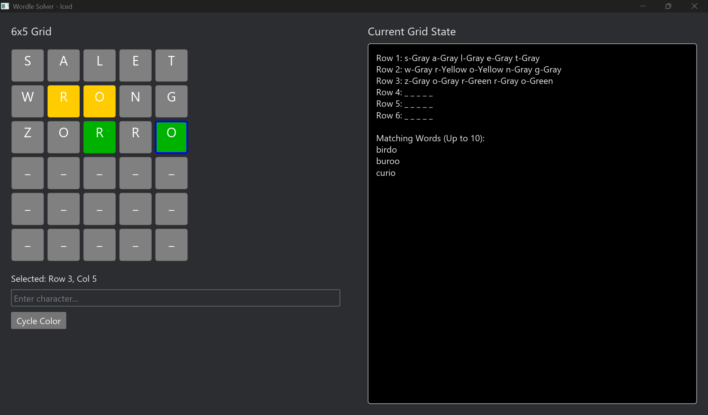

# wordle-solver
not really a solver, more like a helper

works pretty well methinks, besides needing to select the cells one by one to input instead of automatically selecting the next cell

you can check older commits for the cli version

